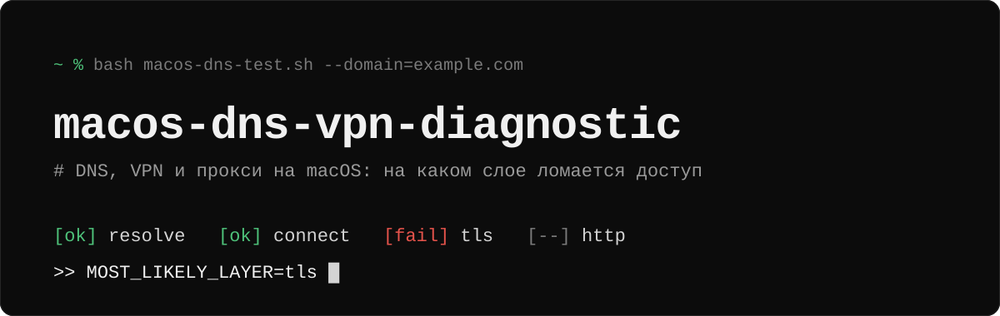
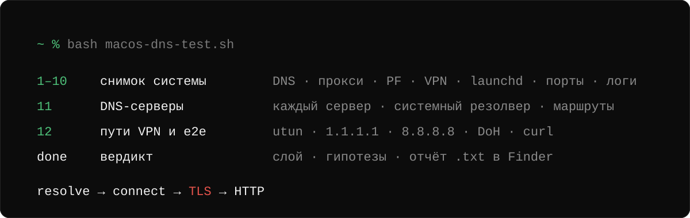

<p align="center">
  
</p>

<p align="center">
  <a href="https://github.com/f0nwa/macos-dns-vpn-diagnostic/actions/workflows/ci.yml"></a>
  <a href="LICENSE"></a>
  <a href="#требования"></a>
  <a href="macos-dns-test.sh"></a>
  <a href=".github/workflows/ci.yml"></a>
</p>

**`macos-dns-test.sh`** — скрипт для диагностики DNS, VPN/прокси и сетевой фильтрации на macOS. Он снимает полный сетевой срез, проверяет домен по каждому пути резолвинга и сквозным запросом, а затем называет наиболее вероятную причину и слой, на котором ломается доступ. Результат — текстовый отчёт, который можно сразу отправить в поддержку.

- [Быстрый старт](#быстрый-старт)
- [Что вы получите](#что-вы-получите)
- [Как это работает](#как-это-работает)
- [Доступ к папкам и приватность](#доступ-к-папкам-и-приватность)
- [Требования](#требования)
- [Флаги](#флаги)
- [Для контрибьюторов](#для-контрибьюторов)
- [English](#english)

## Быстрый старт

```bash
bash <(curl -fsSL "https://raw.githubusercontent.com/f0nwa/macos-dns-vpn-diagnostic/main/macos-dns-test.sh")
```

<details>
<summary>Сначала скачать и посмотреть, потом запустить</summary>

```bash
curl -fL "https://raw.githubusercontent.com/f0nwa/macos-dns-vpn-diagnostic/main/macos-dns-test.sh" -o /tmp/macos-dns-test.sh
bash /tmp/macos-dns-test.sh
```

Из локального клона: `./macos-dns-test.sh`.

</details>

Что будет происходить:

1. Скрипт спросит домен для проверки — латиницей или кириллицей, в формате `name.zone`.
2. Объяснит, зачем нужен пароль администратора (символы при вводе не отображаются — это нормально), и попросит его: часть проверок требует `sudo`.
3. Для кириллического домена нужен `python3`. Если его нет, скрипт предложит установить `Homebrew + python3` или ввести punycode вручную.
4. На шаге `7/12` macOS может не пустить скрипт в часть папок `~/Library`. Тогда он покажет эти папки и предложит выдать доступ — подробнее в разделе [«Доступ к папкам и приватность»](#доступ-к-папкам-и-приватность).
5. В конце покажет блок «Результат проверки» (вердикт, возможные проблемы, заметки), путь к отчёту и откроет Finder с выделенным файлом — его можно сразу перетащить в мессенджер или письмо.
6. Если «Полный доступ к диску» для терминала был выдан во время этого запуска, скрипт напомнит выключить его обратно.

Язык интерфейса и отчёта выбирается по языку macOS: русский или английский. Принудительно: `DNS_DIAG_LANG=en` или `DNS_DIAG_LANG=ru` перед командой запуска.

> [!WARNING]
> **Перед отправкой отчёта** просмотрите его: там есть внутренние IP, имена хостов, пути и фрагменты системных логов.

## Что вы получите

Отчёт `<user>_<host>_dns_diag_<YYYYMMDD_HHMMSS>.txt` в текущей папке. Начинать чтение стоит с итоговых секций (значения ниже — пример):

```text
>> E2E_RESULT
url=https://example.com
resolve_phase=ok
connect_phase=ok
tls_phase=fail
http_phase=not_run
verdict=FAIL

>> PRIMARY_CLASSIFICATION
PRIMARY_CLASSIFICATION=tls_certificate_or_trust_issue
MOST_LIKELY_LAYER=tls
HUMAN_STATUS=ТЕСТ ЧАСТИЧНО ПРОЙДЕН: хост доступен, но TLS сертификат не прошел проверку доверия

>> EXEC_SUMMARY
1. [HIGH/70] TLS certificate untrusted (layer=tls)
   evidence: connect ok, tls handshake fail
   next: проверить сертификат перехватывающего прокси/фильтра
```

Дальше идут `DNS_ONLY_RESULT` (итог по каждому резолверу), `EVIDENCE_MATRIX` (все гипотезы с доказательствами, уровнем уверенности и следующей проверкой), «Возможные причины проблем с DNS» и «К сведению» — то, что выглядит подозрительно, но проблемой не является (например, NXDOMAIN от локального DNS при split-DNS через VPN). Если какую-то проверку выполнить не удалось, в конце будет блок **«ОТЧЁТ НЕПОЛНЫЙ»** с объяснением.

## Как это работает

<p align="center">
  
</p>

**Снимок системы (шаги 1–10).** Настройки DNS и прокси (`scutil`, `networksetup`), PF firewall со всеми анкерами, сетевые расширения и VPN/прокси-процессы, службы launchd, локальные слушатели портов, короткий захват DNS-трафика и логи `mDNSResponder`/NetworkExtension.

**DNS-серверы и маршруты (шаг 11).** Домен проверяется через каждый найденный DNS-сервер (`scutil`, `networksetup`, `/etc/resolv.conf`) и через системный резолвер. Снимаются маршрут по умолчанию, таблица маршрутизации и `utun`-интерфейсы.

**Пути VPN, внешние резолверы и e2e (шаг 12).** Домен проверяется через scoped-резолверы каждого интерфейса, включая VPN (`utun`), с учётом `/etc/resolver` и `/etc/hosts`. Затем — через независимые резолверы Cloudflare и Google (UDP-53, TCP-53, DoH), и их ответы сверяются с системными. Так видно, сломан или подменён DNS локально, заблокирован домен снаружи или фильтруется только порт 53. Затем `curl` проходит всю цепочку: resolve → connect → TLS → HTTP.

**Вердикт.** Собранные факты складываются в гипотезы с оценкой уверенности (HIGH/MED/LOW) по слоям: резолвер, туннель, маршрут, политики PF, перехватчик трафика, TLS, внешняя сеть.

Что скрипт умеет находить сверх обычных проверок:

- **Обходы маршрутизации в PF.** Правила `route-to`, `rdr`, `divert-to` во всех анкерах, включая вложенные `com.apple/*`, которые уводят трафик мимо таблицы маршрутов.
- **DPI-обходы.** ZapretMac (Flowseal), zapret (`tpws`/`dvtws`), SpoofDPI, ByeDPI (`ciadpi`) — по службам, процессам, путям установки и PF-анкерам. Скрипт отличает запущенный инструмент от просто установленного и подсказывает, как его остановить. Типичный симптом: DNS в порядке, а соединения с ресурсами за VPN висят до таймаута, потому что трафик уходит через Wi-Fi/Ethernet мимо туннеля.
- **Split-DNS.** Если домен резолвится только через VPN, отказ остальных DNS-серверов не считается проблемой.

## Доступ к папкам и приватность

**Что читается.** Скрипт собирает много системной информации: сетевые настройки, сервисы, процессы, правила firewall, системные логи. На шаге `7/12` он ищет конфиги VPN/прокси-приложений в `~/Library` только **по именам папок** — содержимое файлов не читается, системные папки Apple (`com.apple.*`) и папки с личными данными (Контакты, Календари, Почта и т.п.) пропускаются.

**Если macOS не пустила в папку.** Часть папок `~/Library` (например, `Application Support/FileProvider`, `Caches/CloudKit`) macOS закрывает без какого-либо запроса — открыть их можно только через «Полный доступ к диску». В этом случае скрипт:

1. перечислит недоступные папки и спросит, выдать ли доступ;
2. откроет «Системные настройки → Конфиденциальность и безопасность → Полный доступ к диску»;
3. попросит включить `Terminal` (если его нет в списке: «+» → Программы → Утилиты → Terminal) и нажать Enter;
4. повторит поиск;
5. в конце напомнит отключить «Полный доступ к диску» для терминала: он нужен только на время работы скрипта (Системные настройки → Конфиденциальность и безопасность → Полный доступ к диску).

> [!TIP]
> Если macOS предложит завершить Terminal, выберите **«Позже»** — иначе диагностика прервётся. Если доступ не заработал сразу, скрипт попросит перезапустить Terminal и запустить диагностику снова.

Выдавать доступ не обязательно: диагностика продолжится, а шаг `7/12` будет помечен как неполный в консоли и в отчёте (`APP_CONFIG_SCAN_ACCESS` и блок «ОТЧЁТ НЕПОЛНЫЙ»). Сбросить ранее выданные Terminal разрешения: `tccutil reset All com.apple.Terminal`.

**Внешние запросы.** По умолчанию скрипт обращается к публичным DNS/HTTPS-сервисам Cloudflare (`1.1.1.1`, `cloudflare-dns.com`) и Google (`8.8.8.8`, `dns.google`) для независимой проверки резолвинга. Отключается флагом `--no-external-dns`.

## Требования

| Компонент | | Комментарий |
| --- | --- | --- |
| macOS | обязательно | проверено на macOS Tahoe 26 |
| `bash` | обязательно | достаточно системного `/bin/bash` 3.2 |
| `sudo` | обязательно | часть проверок требует прав администратора |
| `dig` | желательно | без него используется `nslookup` |
| `python3` | опционально | для кириллических (IDN) доменов |
| `brew` | опционально | скрипт может установить его сам после подтверждения |

## Флаги

Без флагов скрипт работает интерактивно. Для автоматизации:

```bash
./macos-dns-test.sh --domain=example.com --yes --output=/tmp/report.txt
```

| Флаг | Назначение |
| --- | --- |
| `--domain=<host>` | не спрашивать домен |
| `--yes` | отвечать «да» на все вопросы (в т.ч. установку Homebrew/python3) и не задавать вопросов о доступе к папкам |
| `--output=<path>` | путь к файлу отчёта вместо `./<user>_<host>_dns_diag_<ts>.txt` |
| `--no-external-dns` | не обращаться к внешним DNS/DoH (Cloudflare, Google) |
| `--no-open` | не открывать Finder с отчётом после завершения |
| `--verify-integrity` | перед запуском сверить sha256 скрипта с `checksums.txt` (только из локального клона, см. ниже) |

Без интерактивного терминала и в CI скрипт не предлагает выдать доступ к папкам и не открывает Finder. Цвета и анимацию отключает вывод не в терминал, а цвета — ещё и переменная `NO_COLOR=1`. Цвет подсказок подбирается под фон терминала (на тёмном — яркий белый); если определение не сработало, задайте `DNS_DIAG_BG=dark` или `DNS_DIAG_BG=light`.

## Для контрибьюторов

<details>
<summary>Тесты, линтинг, CI, git-хуки и проверка целостности</summary>

### Тесты и линтинг

Тесты идут с русским интерфейсом (`DNS_DIAG_LANG=ru` задаётся в `tests/lib/extract.bash`); английский проверяет `i18n.bats`. Тесты на [bats-core](https://github.com/bats-core/bats-core) лежат в `tests/`. Они берут функции прямо из `macos-dns-test.sh` (`tests/lib/extract.bash`), поэтому всегда проверяют актуальный код.

```bash
brew install bats-core shellcheck bash
shellcheck -S warning macos-dns-test.sh scripts/*.sh
bats tests/*.bats
```

> [!NOTE]
> Под системным `/bin/bash` 3.2 bats не находит тесты с кириллицей в названии (`bats: unknown test name`), поэтому сам bats нужно запускать под bash из Homebrew. Полный прогон скрипта в `cli_flags.bats` при этом всё равно идёт под `/bin/bash` — как у пользователей.

| Файл | Что проверяет |
| --- | --- |
| `cli_flags.bats` | флаги и полный неинтерактивный прогон скрипта |
| `hypotheses.bats` | движок гипотез и уровни уверенности |
| `split_dns.bats` | NXDOMAIN от локального DNS при split-DNS через VPN |
| `external_consistency.bats` | сверка ответов внешних и системных резолверов |
| `dpi_bypass.bats` | PF-перенаправления в анкерах и сигнатуры DPI-обходов |
| `app_config_scan.bats` | поиск конфигов на шаге 7, недоступные папки и запрос доступа |
| `regex_regression.bats` | разбор `scutil --dns` |
| `report_capture.bats` | `tcpdump` не дописывает пакеты в отчёт после таймаута |
| `spinner.bats` | спиннер не зависает и не печатает предупреждения bash 3.2 |
| `reveal_report.bats` | открытие Finder с отчётом и случаи, когда этого делать нельзя |
| `detail_color.bats` | выбор цвета подсказок по фону терминала |
| `i18n.bats` | выбор языка, английская справка и отсутствие кириллицы в английском прогоне |

CI (`.github/workflows/ci.yml`) запускает ShellCheck и все тесты на `macos-latest` при каждом push и PR.

### Git-хуки и проверка целостности

```bash
./scripts/install-git-hooks.sh
```

Хук `.githooks/pre-commit` при коммите `macos-dns-test.sh` обновляет дату в `# Last Modified:` и в `SCRIPT_VERSION`, а также пересчитывает `checksums.txt`.

`--verify-integrity` хэширует скрипт и сверяет результат с `checksums.txt` — это защищает локальный клон от случайной порчи. Флаг работает только если рядом со скриптом лежит `scripts/integrity-lib.sh`, то есть не при запуске через `curl`. Для защиты от подмены при скачивании `integrity-lib.sh` поддерживает подпись `minisign` (`VERIFY_MODE=strict` + `DNS_DIAG_MINISIGN_PUBKEY`), но ключи подписи в репозитории пока не заведены.

</details>

## English

**`macos-dns-test.sh`** is a script for diagnosing DNS, VPN/proxy and network filtering problems on macOS. It takes a full network snapshot, checks a domain along every resolution path and with an end-to-end request, then names the most likely cause and the layer where access breaks. The result is a text report you can send straight to support.

The interface and the report follow the macOS language (Russian or English). To force one, set `DNS_DIAG_LANG=en` or `DNS_DIAG_LANG=ru` before the command.

### Quick start

```bash
DNS_DIAG_LANG=en bash <(curl -fsSL "https://raw.githubusercontent.com/f0nwa/macos-dns-vpn-diagnostic/main/macos-dns-test.sh")
```

(`DNS_DIAG_LANG=en` is optional: on an English macOS it is picked automatically.) From a local clone: `./macos-dns-test.sh`.

What happens:

1. The script asks for the domain to check, in Latin or Cyrillic letters, in the `name.zone` format.
2. It explains why an administrator password is needed (characters are not shown while you type; this is normal) and asks for it: some checks need `sudo`.
3. For a Cyrillic (IDN) domain `python3` is required. If it is missing, the script offers to install `Homebrew + python3` or to enter the punycode form by hand.
4. On step `7/12` macOS may deny access to some `~/Library` folders. The script then lists them and offers to grant access (see [Folder access and privacy](#folder-access-and-privacy)).
5. At the end it prints a "Check result" block (verdict, possible problems, notes) and the report path, and opens Finder with the report highlighted, ready to drag into a messenger or an email.
6. If Full Disk Access for the terminal was granted during this run, the script reminds you to turn it off again.

> [!WARNING]
> **Review the report before sending it**: it contains internal IP addresses, host names, paths and fragments of system logs.

### What you get

The report `<user>_<host>_dns_diag_<YYYYMMDD_HHMMSS>.txt` is written to the current folder. Start with the summary sections: `E2E_RESULT` (resolve, connect, TLS, HTTP phases), `PRIMARY_CLASSIFICATION` with `MOST_LIKELY_LAYER`, `EXEC_SUMMARY`, then `DNS_ONLY_RESULT`, `EVIDENCE_MATRIX` (every hypothesis with evidence, confidence and the next check), "Possible causes of DNS problems" and "For your information (not problems)": things that look suspicious but are not (for example NXDOMAIN from a local DNS under split DNS through a VPN). If a check could not be completed, the report ends with a **REPORT INCOMPLETE** block explaining why.

### How it works

- **System snapshot (steps 1-10).** DNS and proxy settings (`scutil`, `networksetup`), the PF firewall with all anchors, network extensions and VPN/proxy processes, launchd services, local port listeners, a short DNS traffic capture, `mDNSResponder`/NetworkExtension logs.
- **DNS servers and routes (step 11).** The domain is checked through every DNS server found (`scutil`, `networksetup`, `/etc/resolv.conf`) and through the system resolver. The default route, the routing table and the `utun` interfaces are recorded.
- **VPN paths, external resolvers and e2e (step 12).** The domain is checked through the scoped resolvers of every interface including VPN (`utun`), taking `/etc/resolver` and `/etc/hosts` into account. Then through the independent Cloudflare and Google resolvers (UDP-53, TCP-53, DoH), comparing their answers with the system ones, so you can see whether DNS is broken or spoofed locally, the domain is blocked from outside, or only port 53 is filtered. Finally `curl` walks the whole chain: resolve → connect → TLS → HTTP.
- **Verdict.** The facts become hypotheses with a confidence level (HIGH/MED/LOW) per layer: resolver, tunnel, route, PF policy, traffic interceptor, TLS, external network.

Beyond the usual checks the script finds PF routing bypasses (`route-to`, `rdr`, `divert-to` in every anchor, including nested `com.apple/*`), DPI bypass tools (ZapretMac, zapret, SpoofDPI, ByeDPI) and tells a running tool from a merely installed one, and recognises split DNS, where other servers failing to resolve a VPN-only domain is not a problem.

### Folder access and privacy

**What is read.** The script collects a lot of system information: network settings, services, processes, firewall rules, system logs. On step `7/12` it looks for VPN/proxy app configs in `~/Library` **by folder names only**: file contents are not read, Apple folders (`com.apple.*`) and personal data folders (Contacts, Calendars, Mail and so on) are skipped.

**If macOS denies access to a folder.** Some `~/Library` folders (for example `Application Support/FileProvider`, `Caches/CloudKit`) are closed without any prompt and can only be opened through Full Disk Access. The script then lists the folders, offers to open System Settings > Privacy & Security > Full Disk Access, asks you to enable `Terminal` (if it is not listed: `+` > Applications > Utilities > Terminal) and press Enter, repeats the search, and at the end reminds you to turn Full Disk Access off again: it is only needed while the script runs.

> [!TIP]
> If macOS offers to quit Terminal, choose **"Later"**, otherwise the diagnostics are interrupted. If access does not take effect immediately, restart Terminal and run the script again.

Granting access is optional: the diagnostics continue and step `7/12` is marked incomplete in the console and in the report (`APP_CONFIG_SCAN_ACCESS` and the REPORT INCOMPLETE block). Reset permissions granted to Terminal earlier: `tccutil reset All com.apple.Terminal`.

**External requests.** By default the script contacts public Cloudflare (`1.1.1.1`, `cloudflare-dns.com`) and Google (`8.8.8.8`, `dns.google`) services for independent resolution checks. Disable with `--no-external-dns`.

### Requirements

| Component | | Notes |
| --- | --- | --- |
| macOS | required | tested on macOS Tahoe 26 |
| `bash` | required | the system `/bin/bash` 3.2 is enough |
| `sudo` | required | some checks need administrator rights |
| `dig` | recommended | `nslookup` is used without it |
| `python3` | optional | for Cyrillic (IDN) domains |
| `brew` | optional | the script can install it after confirmation |

### Flags

Without flags the script is interactive. For automation:

```bash
./macos-dns-test.sh --domain=example.com --yes --output=/tmp/report.txt
```

| Flag | Purpose |
| --- | --- |
| `--domain=<host>` | do not ask for the domain |
| `--yes` | answer "yes" to every question (including installing Homebrew/python3) and skip the folder-access questions |
| `--output=<path>` | report path instead of `./<user>_<host>_dns_diag_<ts>.txt` |
| `--no-external-dns` | do not contact external DNS/DoH (Cloudflare, Google) |
| `--no-open` | do not open Finder with the report when finished |
| `--verify-integrity` | compare the script's sha256 with `checksums.txt` before running (local clone only) |

Environment variables: `DNS_DIAG_LANG=en|ru` forces the interface language; `NO_COLOR=1` turns colors off; `DNS_DIAG_BG=dark|light` sets the terminal background if auto-detection fails (hints are bright white on dark backgrounds). Without an interactive terminal and in CI the script does not offer folder access and does not open Finder.

### Contributing

Tests use [bats-core](https://github.com/bats-core/bats-core) and live in `tests/` (they run with the Russian interface, `i18n.bats` covers English). Lint and test with `shellcheck -S warning macos-dns-test.sh scripts/*.sh` and `bats tests/*.bats`; run bats under bash from Homebrew (the system bash 3.2 cannot find tests with Cyrillic names). Install the git hook with `./scripts/install-git-hooks.sh`: on commit it updates `# Last Modified:`, `SCRIPT_VERSION` and `checksums.txt`. Every user-facing string goes through `tx "english" "русский"`; `i18n.bats` fails when a string is left untranslated.

## Лицензия

MIT — см. [`LICENSE`](LICENSE).
